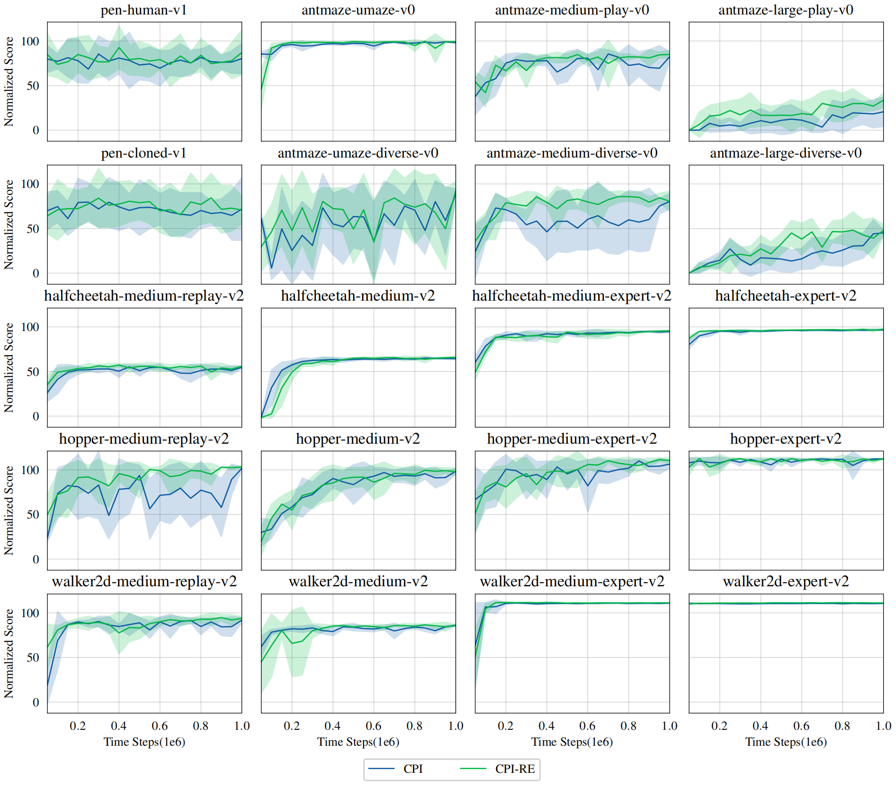

# Iteratively Refined Behavior Regularization for Offline Reinforcement Learning

we propose an innovative offline RL algorithm
termed Conservative Policy iteration (CPI). By iteratively
refining the policy used for regularization, CPI progressively
improves itself within the behavior policy’s support and
provably converges to the in-sample optimal policy in the
tabular setting.


## Usage

The paper results can be reproduced by running:

For MuJoCo:
```
python main.py --env halfcheetah-medium-v2 --normalize --qweight=0.05 --aweight=0.7  --seed 42
```
For Antmaze:
```
python main.py --env antmaze-umaze-v0 --qweight=1.0 --aweight=0.7  --reward_scale=4.0  --reward_bias=-2.0 --critic_lr=1e-3 --discount=0.995 --seed 42
```
For Adroit:
```
python main.py --env pen-human-v1 --qweight=100.0 --aweight=0.5  --reward_standardize --seed 42
```

## Result


